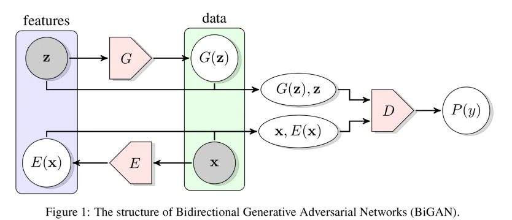

Efficient GAN-Based Anomaly Detection(Keras)
====

Provided Notebook

- AnnoGAN
 - https://arxiv.org/abs/1703.05921
- Efficient GAN-Based Anomaly Detection
 - https://arxiv.org/abs/1802.06222

## Description

Fast Anomaly Detection by GAN




## Requirement

If you use a Google colaboratry, you don't install following library.

https://colab.research.google.com/notebooks/welcome.ipynb?hl=ja#recent=true

### Standard Library Install

```
sudo apt-get update
sudo apt-get install -y python3-pip
sudo apt-get install -y libhdf5-serial-dev hdf5-tools libhdf5-dev zlib1g-dev zip libjpeg8-dev python3-matplotlib
sudo apt-get install -y libblas3 liblapack3 liblapack-dev libblas-dev gfortran
```

### Library Install

```
pip3 install requirements.txt

```

### Jupyter Lab install

```
sudo apt install -y nodejs npm
sudo pip3 install jupyterlab==1.0.4
```

## Usage

```
jupyter-lab
```

## Reference

- [EFFICIENT GAN-BASED ANOMALY DETECTION](https://arxiv.org/pdf/1802.06222.pdf)
- [anogan-keras](https://github.com/tkwoo/anogan-keras)

## Licence

[MIT](https://github.com/tcnksm/tool/blob/master/LICENCE)

## Author

[SnowMasaya](https://github.com/SnowMasaya)